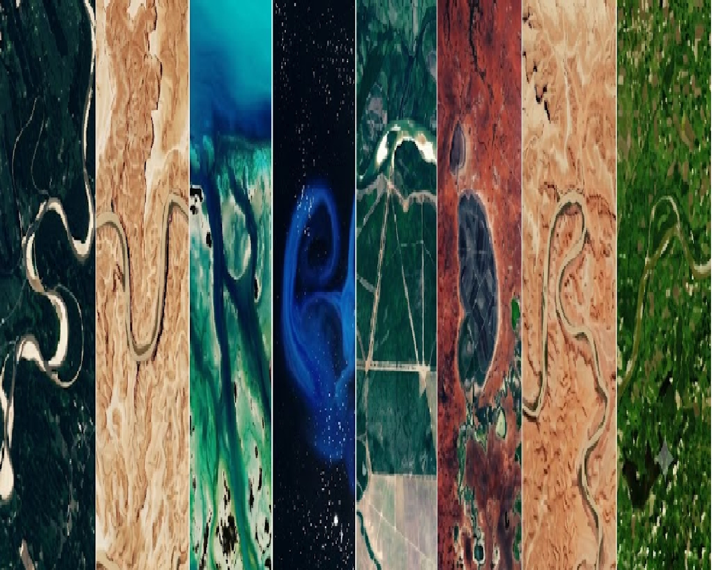

---
hide:
  - toc
  - navigation
---
<!--
CHECKLIST FOR THIS PAGE:
- [ ] Replace [YOUR NAME] with your full name (3 places)
- [ ] Replace [YOUR JOB TITLE] with your current or target role
- [ ] Replace [YOUR TAGLINE] with a short phrase describing your focus
- [ ] Rewrite the About Me paragraph with your own words
- [ ] Replace assets/images/profile.png with your actual photo (keep the filename or update it below)
- [ ] Replace assets/images/about.png with your own image (a field photo, map, or workspace shot)
- [ ] Edit the skill cards to match your actual skills (add, remove, or rename cards as needed)
- [ ] Update GitHub and LinkedIn links in the Connect section
- [ ] Add your CV PDF to docs/assets/ and update the filename in the Download CV button
-->

  
  <h1>Surendra Shiwakoti</h1>
  
<strong>Research Associate at TH-Köln (Geospatial)</strong>

  
<em>Turning spatial data into insights | GIS | Remote Sensing | Python</em>

---

## About Me

The biggest challenges our planet faces today are climate change, rapid urbanization, and natural disasters occuring around us. I work on the geospatial tools and data pipelines needed to understand exactly where, why, and what we can do about it. 
My expertise lies at the intersection of remote sensing, spatial data science, and software engineering. I translate complex, multi-source Earth observation data into actionable intelligence and interactive Web-GIS applications that drive sustainable decision-making.
Currently, I support Co-Site Project at Cologne University of Applied Sciences to facilitate datasets to visualize climate risks, model urban growth effects, and support municipalities for data-driven decisions for global environmental challenges.

### My core research / support areas

🌍 **Climate & Disaster Resilience**

    - Urban heat islands
    - Land-use change
    - Climate change adaptation

💻 **Geospatial Automation**

    - Python pipelines
    - Google Earth Engine workflows

📊 **Interactive Web-GIS**

    - Dashboards
    - Web applications

🚀 **Advanced Spatial Modeling**

    - Machine learning
    - Geosimulation
    - Photogrammetry

**Core Toolkit:**

    - Languages: Python, JavaScript, R, SQL, Java
    - Platforms & Tools: Google Earth Engine (GEE), QGIS, ArcGIS, ENVI, ERDAS, SDI

  

---

[View My Projects :material-arrow-right:](projects/index.md){ .md-button .md-button--primary }
[Download CV :material-download:](assets/[YOUR-NAME]-CV.pdf){ .md-button }

---

## Skills

-   :material-layers:{ .lg .middle } **GIS & Remote Sensing**

    ---

    - QGIS, ArcGIS Pro, Google Earth Engine
    - GDAL / OGR, GRASS GIS
    - Multispectral and SAR image analysis
    - Cloud Native Geospatial (COG, STAC, Zarr)

-   :material-code-braces:{ .lg .middle } **Programming**

    ---

    - Python — GeoPandas, NumPy, Pandas, Matplotlib
    - R — sf, terra, ggplot2
    - JavaScript — Leaflet, MapLibre GL
    - SQL, PostgreSQL + PostGIS

-   :material-star-four-points:{ .lg .middle } **Machine Learning & GeoAI**

    ---

    - Supervised classification — Random Forest, XGBoost
    - Deep learning for image segmentation — U-Net, SAM
    - scikit-learn, PyTorch, TensorFlow
    - Object detection in satellite imagery

-   :material-earth:{ .lg .middle } **Web Mapping & Data**

    ---

    - Leaflet.js, Folium, MapLibre GL JS
    - Cloud storage — AWS S3, Google Cloud Storage
    - Data formats — GeoTIFF, GeoParquet, NetCDF
    - Streamlit for data-driven web apps

-   :material-database:{ .lg .middle } **Data & Cloud**

    ---

    - PostgreSQL + PostGIS
    - Cloud storage: AWS S3, Google Cloud Storage
    - Data formats: GeoJSON, GeoTIFF, NetCDF, Zarr, GeoParquet

-   :material-airplane:{ .lg .middle } **Drone / UAV Data Processing**

    - Mission planning and flight operations
    - Photogrammetry: Agisoft Metashape, OpenDroneMap
    - Point cloud processing: CloudCompare, PDAL

---

## Connect

[GitHub](https://github.com/shiwakotisurendra){ .md-button }
[LinkedIn](https://linkedin.com/in/geosuren){ .md-button }
